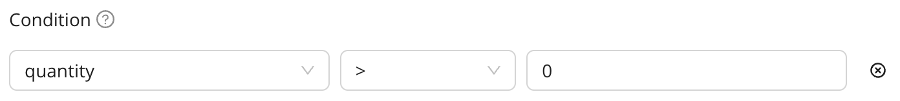
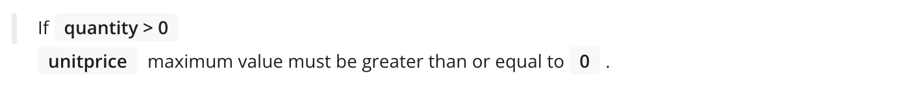

An Expectation is a verifiable assertion about your data. They make implicit assumptions about your data explicit, and they provide a flexible, declarative language for describing expected behavior. They can help you better understand your data and help you improve data quality.

<!-- [//]: # (TODO: To learn more about Expectations, see Expectation.) -->

## Prerequisites

- You have a [Data Asset](/cloud/data_assets/manage_data_assets.md).

## Available Expectations

The following table lists the available GX Cloud Expectations.

| Data Quality Issue | Expectation                                               | Description                                                                                                                            | Dynamic Parameters? |
|--------------------|-----------------------------------------------------------|----------------------------------------------------------------------------------------------------------------------------------------|--------------------|
| Cardinality        | `expect_column_values_to_be_unique`                       | Expect each column value to be unique.                                                                                                 | No |
| Cardinality        | `expect_compound_columns_to_be_unique`                    | Expect the compound columns to be unique.                                                                                              | No |
| Cardinality        | `expect_select_column_values_to_be_unique_within_record`  | Expect the values for each record to be unique across the columns listed. Note that records can be duplicated.                         | No |
| Cardinality        | `expect_column_proportion_of_unique_values_to_be_between` | Expect the proportion of unique values to be between a minimum value and a maximum value.                                              | Yes |
| Cardinality        | `expect_column_unique_value_count_to_be_between`          | Expect the number of unique values to be between a minimum value and a maximum value.                                                  | Yes |
| Data Integrity     | `expect_column_pair_values_to_be_equal`                   | Expect the values in column A to be the same as column B.                                                                              |  No |
| Data Integrity     | `expect_multicolumn_sum_to_equal`                         | Expect that the sum of row values in a specified column list is the same for each row, and equal to a specified sum total.             | No |
| Distribution       | `expect_column_pair_values_A_to_be_greater_than_B`        | Expect the values in column A to be greater than column B.                                                                             | No |
| Distribution       | `expect_column_values_to_be_between`                      | Expect the column entries to be between a minimum value and a maximum value.                                               | No |
| Distribution       | `expect_column_z_scores_to_be_less_than`                  | Expect the Z-scores of a column's values to be less than a given threshold.                                                            | No |
| Distribution       | `expect_column_stdev_to_be_between`                       | Expect the column standard deviation to be between a minimum value and a maximum value.                                                | Yes |
| Distribution       | `expect_column_sum_to_be_between`                         | Expect the column sum to be between a minimum value and a maximum value.                                                               | Yes |
| Missingness        | `expect_column_values_to_be_null`                         | Expect the column values to be null.                                                                                                   | Coming soon |
| Missingness        | `expect_column_values_to_not_be_null`                     | Expect the column values to not be null.                                                                                               | Coming soon |
| Numerical Data     | `expect_column_max_to_be_between`                         | Expect the column maximum to be between a minimum and a maximum value.                                                                 | Yes |
| Numerical Data     | `expect_column_mean_to_be_between`                        | Expect the column mean to be between a minimum and a maximum value.                                                        | Yes |
| Numerical Data     | `expect_column_median_to_be_between`                      | Expect the column median to be between a minimum and a maximum value.                                                                  | Yes |
| Numerical Data     | `expect_column_min_to_be_between`                         | Expect the column minimum to be between a minimum value and a maximum value.                                                           | Yes |
| Pattern matching   | `expect_column_value_length_to_equal`                     | Expect the column entries to be strings with length equal to the provided value.                           | No |
| Pattern matching   | `expect_column_value_length_to_be_between`                | Expect the column entries to be strings with length between a minimum value and a maximum value.                           | No |
| Pattern matching   | `expect_column_values_to_match_like_pattern`              | Expect the column entries to be strings that match a given like pattern expression.                                                    | No |
| Pattern matching   | `expect_column_values_to_match_like_pattern_list`         | Expect the column entries to be strings that match any of a provided list of like pattern expressions.                                 | No |
| Pattern matching   | `expect_column_values_to_match_regex`                     | Expect the column entries to be strings that match a given regular expression.                                                         | No |
| Pattern matching   | `expect_column_values_to_match_regex_list`                | Expect the column entries to be strings that can be matched to either any of or all of a list of regular expressions.                  | No |
| Pattern matching   | `expect_column_values_to_not_match_like_pattern`          | Expect the column entries to be strings that do NOT match a given like pattern expression.                                             | No |
| Pattern matching   | `expect_column_values_to_not_match_like_pattern_list`     | Expect the column entries to be strings that do NOT match any of a provided list of like pattern expressions.                          | No |
| Pattern matching   | `expect_column_values_to_not_match_regex`                 | Expect the column entries to be strings that do NOT match a given regular expression.                                                  | No |
| Pattern matching   | `expect_column_values_to_not_match_regex_list`            | Expect the column entries to be strings that do not match any of a list of regular expressions. Matches can be anywhere in the string. | No |
| Schema             | `expect_column_to_exist`                                  | Checks for the existence of a specified column within a table.                                                                         | No |
| Schema             | `expect_column_values_to_be_in_type_list`                 | Expect a column to contain values from a specified type list.                                                                          | No |
| Schema             | `expect_column_values_to_be_of_type`                      | Expect a column to contain values of a specified data type.                                                                            | No |
| Schema             | `expect_table_column_count_to_be_between`                 | Expect the number of columns in a table to be between two values.                                                                      | Yes |
| Schema             | `expect_table_column_count_to_equal`                      | Expect the number of columns in a table to equal a value.                                                                              | No |
| Schema             | `expect_table_columns_to_match_ordered_list`              | Expect the columns in a table to exactly match a specified list.                                                                       | No |
| Schema             | `expect_table_columns_to_match_set`                       | Expect the columns in a table to match an unordered set.                                                                               | No |
| Sets               | `expect_column_values_to_be_in_set`                       | Expect each column value to be in a given set.                                                                                         | No |
| Sets               | `expect_column_values_to_not_be_in_set`                   | Expect column entries to not be in the set.                                                                                            | No |
| Sets               | `expect_column_distinct_values_to_be_in_set`              | Expect the set of distinct column values to be contained by a given set.                                                               | No |
| Sets               | `expect_column_distinct_values_to_contain_set`            | Expect the set of distinct column values to contain a given set.                                                                       | No |
| Sets               | `expect_column_distinct_values_to_equal_set`              | Expect the set of distinct column values to equal a given set.                                                                         | No |
| Sets               | `expect_column_most_common_value_to_be_in_set`            | Expect the most common value to be within the designated value set.                                                                    | No |
| Volume             | `expect_table_row_count_to_be_between`                    | Expect the number of rows to be between two values.                                                                                    | Yes |
| Volume             | `expect_table_row_count_to_equal`                         | Expect the number of rows to equal a value.                                                                                            | No |
| Volume             | `expect_table_row_count_to_equal_other_table`             | Expect the number of rows to equal the number in another table within the same database.                                               | No |

## Custom SQL Expectations

GX Cloud also offers the ability to write a custom Expectation using SQL. It is designed to fail validation if the provided SQL query returns one or more rows.

The provided query should be written in the dialect of the Data Source in which a given Data Asset lives.

:::info Optional `{batch}` named query

The optional `{batch}` named query references the Batch of data under test. When the Expectation is evaluated, the `{batch}` named query will be replaced with the Batch of data that is validated.

:::

## Dynamic Parameters

Dynamic Parameters allow you to create Expectations whose parameters update based on new data. GX Cloud can populate new Expectation parameters at runtime using the last `n` validation results. For example, you can define an Expectation to validate that the maximum value within a column does not exceed 20% above a previously recorded value.

You will be able to input:

1. Sensitivity: `X%` of the average of previous values

2. Constraint: `Above`, `below`, or `above and below` for the sensitivity threshold

3. Run count: `n` previous validation results

When you select your `n` run count, and: 

- There are `0` previous runs, the Expectation will always succeed.

- There are `<n` runs, the Expectation will take all previous runs into account.

- There are `n` runs, the Expectation will take the last `n` runs into account.

- There are `>n` runs, the Expectation will take the last `n` runs into account.

## Expectation condition

The Expectation condition is an optional field that applies to any Expectation validating row-level data. This condition allows you to filter your data so that only a specific subset of your Batch is validated. Rows will be validated only when the condition is true.

You will need to select:

1. A column to check the condition against.
2. An operator that is used to compare the column against a parameter value.
3. A parameter that will be compared against each row in the selected column.

To clear the Expectation condition, click the clear button located on the right-hand side of the condition field.

## Add an Expectation

1. In GX Cloud, click **Data Assets**.

2. In the **Data Assets** list, click the Data Asset name.

3. Click **New Expectation**.

4. Select an Expectation type. See [Available Expectations](#available-expectations).

5. Complete the mandatory and optional fields for the Expectation. A recurring [validation schedule](/cloud/schedules/manage_schedules.md) will be applied automatically to your Expectation. 

6. Click **Save** or click **Save & Add More** and then repeat steps 3 through 6 to add additional Expectations.

7. Optional. Run a Validation. See [Run a Validation](/cloud/validations/manage_validations.md#run-a-validation).

:::tip Automate rules for schema change detection
When you [create a new Data Asset](/cloud/data_assets/manage_data_assets.md#add-a-data-asset-from-an-existing-data-source), you can choose to automatically generate Expectations that detect column changes in that Data Asset.
:::

## Optional. Define a Batch

If your Data Asset has at least one DATE or DATETIME column, you can define a Batch to validate your data incrementally.

1. In GX Cloud, click **Data Assets**.

2. In the **Data Assets** list, click the Data Asset name.

3. Click **Define batch**.

4. Choose how to **Validate by**. Select the **Entire Asset** tab to provide all Data Asset records to your Expectations and validations, or select one of the **Year**/**Month**/**Day** tabs to use subsets of Data Asset records for your Expectations and validations. **Year** partitions Data Asset records by year, **Month** partitions Data Asset records by year and month, **Day** partitions Data Asset records by year, month, and day.

5. Select the **Batch column** that contains the DATE or DATETIME data to partition on.

## Edit an Expectation

1. In GX Cloud, click **Data Assets**.

2. In the **Data Assets** list, click the Data Asset name.

3. Click **Edit Expectation** for the Expectation that you want to edit.

4. Edit the Expectation configuration.

5. Click **Save**.

## Delete an Expectation

1. In GX Cloud, click **Data Assets**.

2. In the **Data Assets** list, click the Data Asset name.

3. Click **Delete Expectation** for the Expectation you want to delete.

4. Click **Yes, delete Expectation**.

## GX-managed vs. API-managed Expectations

In GX Cloud, Expectations can be GX-managed or API-managed.
- GX-managed Expectations are created through the GX Cloud UI.
- API-managed Expectations are created with the API in a GX Cloud Data Context.

If you have both kinds of Expectations, they will be organized in separate tables on the **Expectations** tab as they have different capabilities in the Cloud UI. 

Here is a comparison of key characteristics of GX-managed and API-managed Expectations. 

| Characteristic     | GX-managed Expectation                                                                                                                                                                              | API-managed Expectation                                                                                                                                                                                                                                                                                                     |
|--------------------|-----------------------------------------------------------------------------------------------------------------------------------------------------------------------------------------------------|-----------------------------------------------------------------------------------------------------------------------------------------------------------------------------------------------------------------------------------------------------------------------------------------------------------------------------|
| Edit               | [Edit parameters](/cloud/expectations/manage_expectations.md#edit-an-expectation) with the GX Cloud UI                                                                                              | [Edit parameters with the API](/reference/api/expectations/Expectation_class.mdx) or the GX Cloud UI                                                                                                                                                                                                                        |
| Batch              | [Define a Batch](/cloud/expectations/manage_expectations.md#optional-define-a-batch) in the Cloud UI                                                                                                | Define a Batch with the API when connecting to [SQL](/core/connect_to_data/sql_data/sql_data.md#create-a-batch-definition), [filesystem](/core/connect_to_data/filesystem_data/filesystem_data.md#create-a-batch-definition), or [dataframe](/core/connect_to_data/dataframes/dataframes.md#create-a-batch-definition) data |
| Validate           | [Run a Validation](/docs/cloud/validations/manage_validations.md#run-a-validation) through the Cloud UI or [run a Checkpoint](/core/trigger_actions_based_on_results/run_a_checkpoint.md) with the API | [Create a Validation Definition and run it](/core/run_validations/run_validations.md) with the API                                                                                                                                                                                                                          |
| Validation Results | [Access results in the Validations tab](/cloud/validations/manage_validations.md#view-validation-run-history) of the Cloud UI                                                                       | [Access results with the API](/core/trigger_actions_based_on_results/choose_a_result_format/choose_a_result_format.md) or in the Validations tab of the Cloud UI                                                                                                                                                            |
| Schedule           | Keep default schedule or [edit schedule](/cloud/schedules/manage_schedules.md) in the Cloud UI                                                                                                      | Not supported, use an [orchestrator](/cloud/connect/connect_airflow.md) to control recurring validations                                                                                                                                                                                                                    |
| Expectation Suite  | Automatically organized in a hidden default Expectation Suite                                                                                                                                       | Manually grouped into [custom Expectation Suites](/core/define_expectations/organize_expectation_suites.md) via the API                                                                                                                                                                                                     |
| Delete             | [Delete Expectation](/docs/cloud/expectations/manage_expectations/#delete-an-expectation) with the Cloud UI                                                                                         | [Delete Expectation with the API](/reference/api/ExpectationSuite_class.mdx#great_expectations.ExpectationSuite.delete_expectation) or the Cloud UI                                                                                                                                                                         |

:::note Hidden resources for GX-managed Expectations
To support GX-managed Expectations, we create resources that you typically won't directly interact with. For example, we create a GX-managed Expectation Suite that we use to organize your Expectations. For some workflows you may need to work with these hidden resources, for example, you may need to [find the name of an automatically created Checkpoint](/cloud/connect/connect_airflow.md#create-a-dag-file-for-your-gx-cloud-checkpoint). But, typically you can ignore the existence of these hidden resources. 
:::
