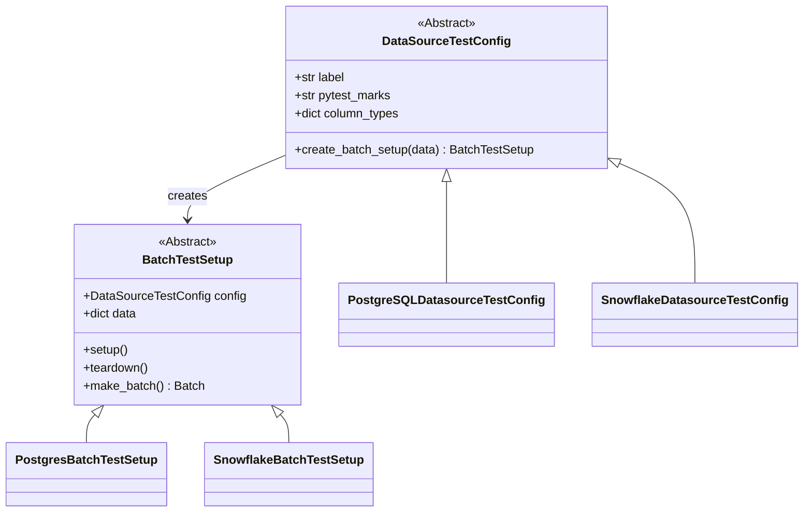
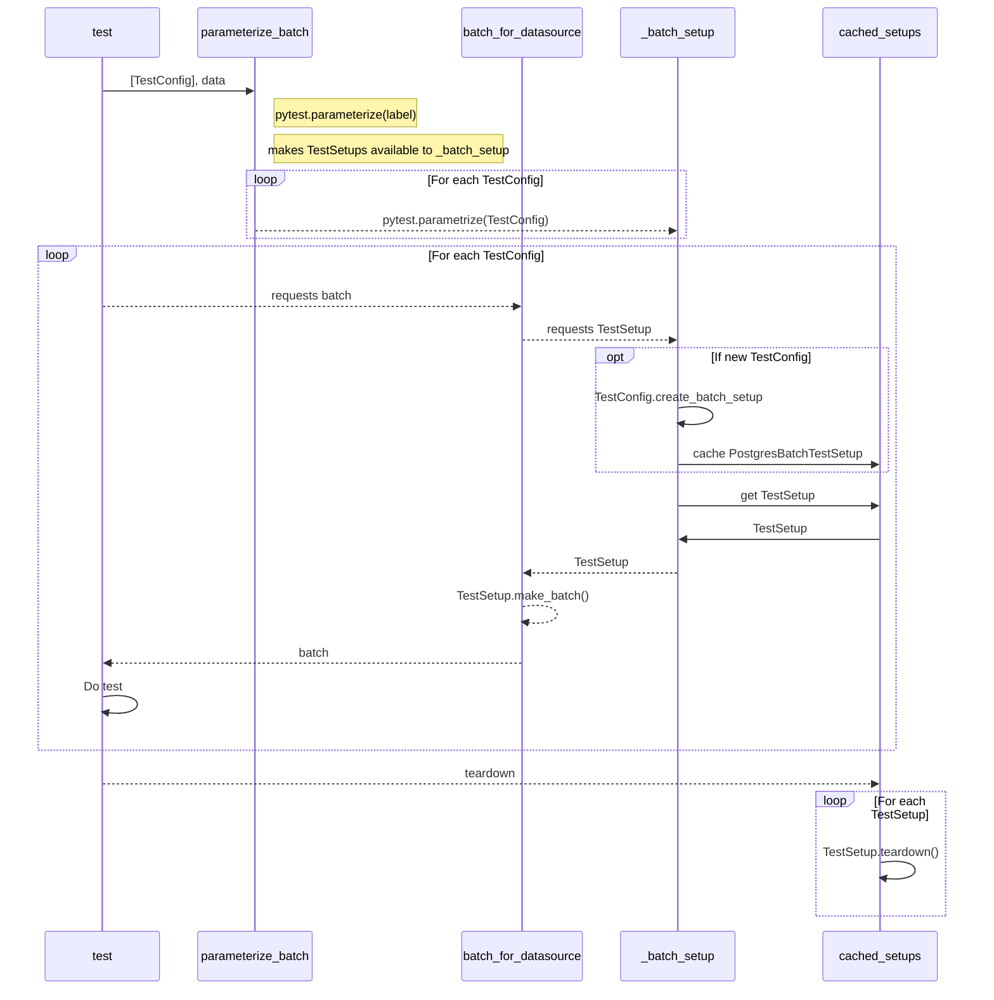

# DataSource and Expectation Integration Tests
Most of the tests in this directory make use of a few utilities that help load data into various data sources.
The following sections provide an overview of how it works.

## Overview of the primary classes

The following is a rough class diagram of the main classes involved in test testing utilities.
* DataSourceTestConfig is the public interface; instance are passed to `parameterize_batch_for_data_sources`
    * Holds optional schema information
    * Knows about pymarks
* BatchTestSetup these are instantiated behind the scenes
    * Holds data
    * Knows about the actual data source
    * Sets up / tears down data

## Overview of the main flow
The following shows the rough flow when running tests with `parameterize_batch_for_data_sources` and the `batch_for_datasource` fixture.

Some names have been truncated in the the diagram

An overview of the main pieces:

* test: this is the test you are writing
* parameterize_batch: `parameterize_batch_for_data_sources`
* `batch_for_datasource`: fixture that pulls in the batch for you
* _batch_setup: `_batch_setup_for_datasource`. fixture that handles caching test configs and calling setup
* cached_setups: ensures that identical TestSetups are only setup / torn down once to improve performance

